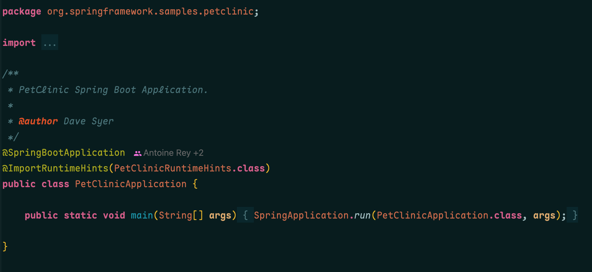
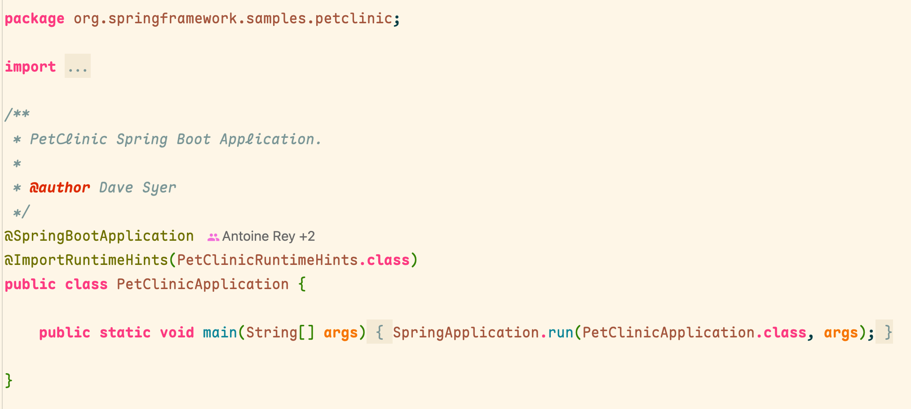
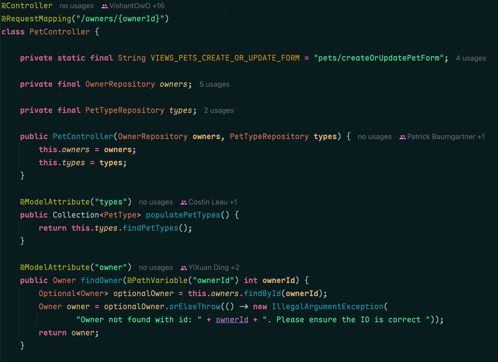
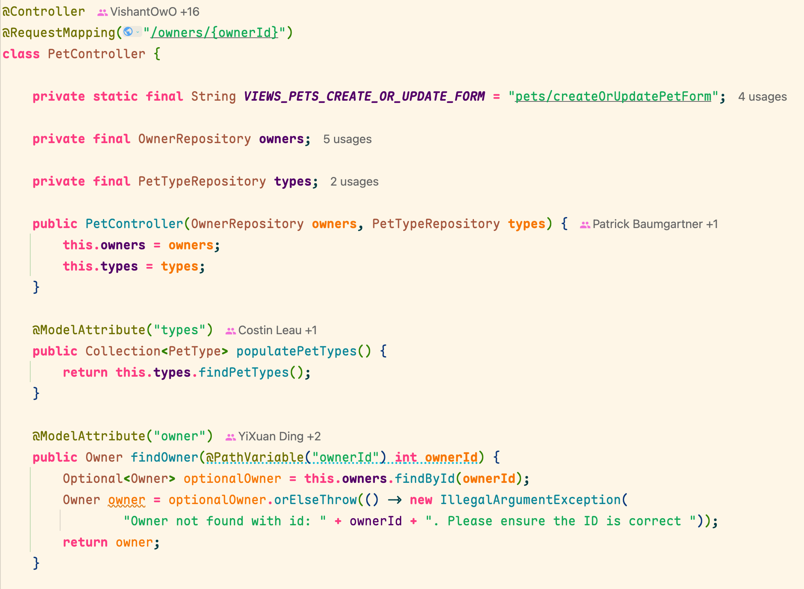
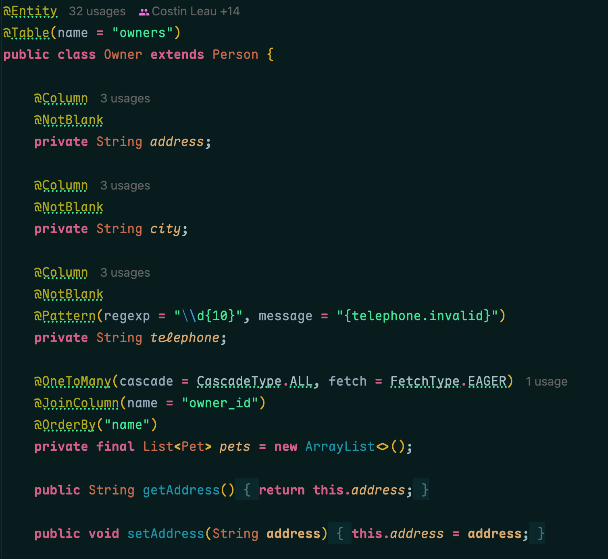
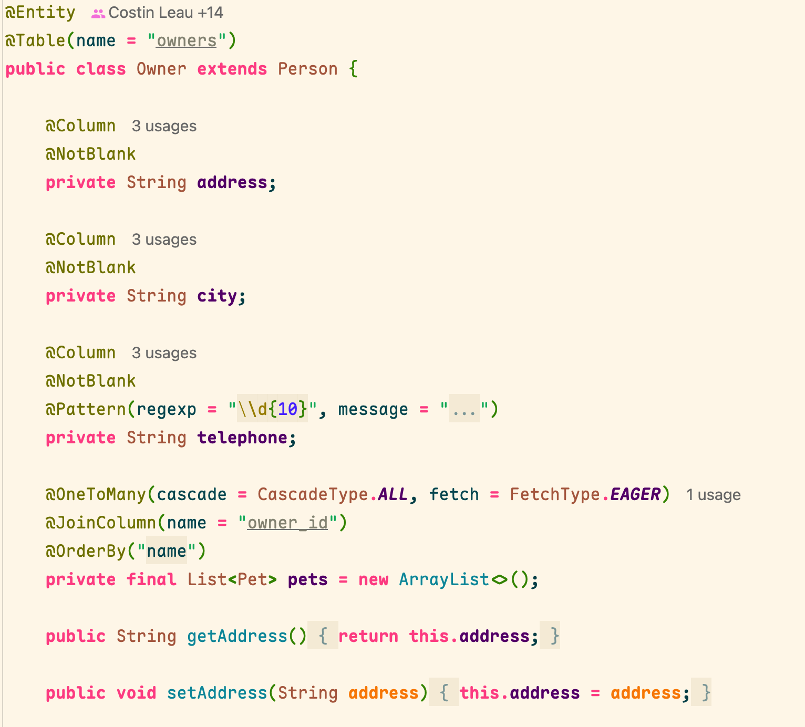

# Noctis JetBrains

JetBrains theme plugin for porting the [Noctis](https://github.com/liviuschera/noctis) theme collection.

## Current Scope

- Generates all 11 upstream Noctis 10.43.3 variants: `Noctis Lux`, `Noctis Hibernus`, `Noctis Lilac`, `Noctis`, `Noctis Azureus`, `Noctis Bordo`, `Noctis Obscuro`, `Noctis Sereno`, `Noctis Uva`, `Noctis Viola`, and `Noctis Minimus`.
- Generates one JetBrains UI theme JSON and one editor color scheme XML for each variant.
- Covers the main IDE surfaces: editor tabs, tool windows, status bar, lists/trees/tables, completion popup, search everywhere, notifications, forms, menus, VCS labels, and icon palette colors.
- Covers the main editor scheme surfaces: code syntax, markup, search, braces, diagnostics, diff/VCS lines, terminal colors, whitespace, caret, gutter, and line numbers.
- Registers every theme through `META-INF/plugin.xml`.
- Includes JetBrains plugin icons and upstream MIT license notice.
- Keeps the upstream Noctis color data in `tools/noctis-source.mjs`.

Generated JSON/XML resources should be regenerated instead of edited directly.

## Screenshots

The screenshots below use the public [Spring PetClinic](https://github.com/spring-projects/spring-petclinic) sample project.

<table>
  <tr>
    <th>Noctis</th>
    <th>Noctis Lux</th>
  </tr>
  <tr>
    <td></td>
    <td></td>
  </tr>
  <tr>
    <td></td>
    <td></td>
  </tr>
  <tr>
    <td></td>
    <td></td>
  </tr>
</table>

## Structure

```text
src/main/resources/
  META-INF/plugin.xml
  META-INF/pluginIcon.svg
  META-INF/pluginIcon_dark.svg
  colors/*.xml
  themes/*.theme.json
tools/
  generate.mjs
  noctis-source.mjs
test/
  generate.test.mjs
```

## Commands

```bash
npm run generate
npm test
npm run check
```

`npm run check` regenerates the JetBrains resources and runs the generator tests.

The Gradle scaffold uses the IntelliJ Platform Gradle Plugin 2.x. Building the plugin distribution needs Java 17+ and Gradle 9+:

```bash
gradle buildPlugin
```

The built plugin zip is written to `build/distributions/`.

For live theme testing:

```bash
gradle runIde
```

## Mapping Notes

The port is intentionally semantic rather than mechanical:

- VS Code `colors` become JetBrains `ui` keys and editor scheme color options.
- VS Code TextMate token groups become JetBrains default editor attributes such as `DEFAULT_KEYWORD`, `DEFAULT_STRING`, and `DEFAULT_LINE_COMMENT`.
- Noctis source colors remain in `tools/noctis-source.mjs`; generated JSON/XML should be regenerated instead of edited directly.

Fidelity decisions worth knowing:

- Default (primary) buttons take the upstream `button.background` teal fill; secondary buttons stay neutral with a border, since IntelliJ splits the two roles while VS Code only has one.
- List/tree selections map to upstream `list.activeSelectionBackground`, hover to `list.hoverBackground`, and the status bar foreground uses the accent color like upstream `statusBar.foreground`.
- Editor scheme `EFFECT_TYPE` values are serialized as the numeric codes IntelliJ expects (for example `WAVE_UNDERSCORE` = 2); string names are silently ignored by the IDE.
- Noctis signature punctuation is reproduced: bold pink accessor dots, bold separators, bold parameters, and orange italic instance fields.
- New UI checkboxes are tinted through the `Checkbox.*` named palette keys, emitted with and without the `.Dark` suffix so both light and dark LaFs pick them up.

## Remaining Release Work

- Run `gradle runIde` and visually inspect the theme in IntelliJ IDEA.
- Check Java/Kotlin/JS/TS/Python/Markdown/HTML/CSS/JSON files with realistic code samples.
- Inspect edge IDE surfaces with UI Inspector/Laf Defaults and add any missing keys to `tools/generate.mjs`.
- Capture Marketplace screenshots after the visual pass.
